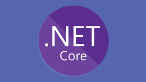
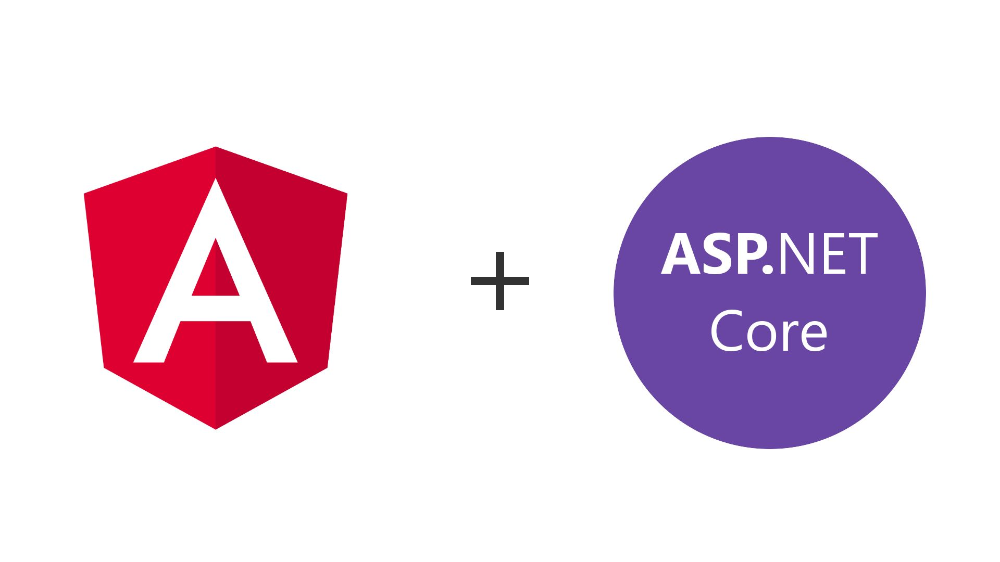

# Introducción

El curso se divide en 2 partes, las cuales coinciden con los elementos que van a componer el proyecto final.

**1ra parte: Web API**

Crearemos una API (Application programing interface) REST, la cual manejara datos, enviara datos, etc. Esta sera realizada utilizando .NET Core y Web API. En esta parte no haremos nada grafico (es decir, no hay *front-end*). Se utilizaran otras herramientas para probarlo.

**2nda parte: Angular**

Crearemos una pagina web utilizando el popular framework Angular 2. Introduciremos el concepto de SPA (*Single page application*) y como los sistemas interactuan (como una web interactua con un backend, entre otros). Desarrollaremos una web que interactua con el backend realizado en la primera parte.

## Tecnologías

**IDE:** 

Utilizaremos **Visual Studio Code** como editor de texto. En conjunto con algunas extensiones terminar asemejandose mucho a un IDE completo, ya que tiene autocompletar, capacidades de debugging, etc. Las extensiones recomendadas son las siguientes.

* [C# for VS Code](https://marketplace.visualstudio.com/items?itemName=ms-vscode.csharp): Provee muchas herramientas para mejorar la experiencia de desarrollo
* [TS Lint](https://marketplace.visualstudio.com/items?itemName=ms-vscode.vscode-typescript-tslint-plugin): Linter que sirve para verificar los estilos de Typescript. 

Pueden usar tantas extensiones como quieran. Se puede ver la siguiente guia de desarrollo de NET Core en VS Code [aquí](https://code.visualstudio.com/docs/languages/csharp).

**Base de datos:**

Como base de datos, usaremos **SQL Server 2017**. Esta version es la primera que da soporte a ser instalada en `Linux`, lo cual nos permite poder utilizar tanto `Linux` como `MacOS` como sistema operativo. 

**Lenguaje y plataforma**

*Backend:*

Utilizaremos Net Core, la ultima version del framework .Net completamente Open Source. **Importante: Utilizaremos la version 2.2**

*Frontend:*

Utilizaremos Angular **version 2** para hacer la web.

**Otras herramientas:**

* Utilizaremos Postman para probar la API, en su version 6.7.4.
* Asegurarse de tener Git instalado. Recomiendo utilizar Git por consola, pero tambien se puede utilizar Sourcetree.
* Tener instalado `Node.js` version 10.15.1 LTS. Esto sera utilizado para la parte de Angular. 

El resto de las herramientas seran siendo vistas durante el curso

## Conceptos importantes

Se utilizaran conceptos importantes que seran vistos durante el curso de teorico o ya fueron vistos en la carrera. Estos son los siguientes:

* **APIs Rest:** Que signfica que una API sea REST y cuales son los objetivos de esto. Sera visto durante el curso
* **Conceptos de DA1:** Todos los conceptos aprendidos en DA1 deben ser aplicados aca, tales como los patrones de diseño, Clean Code, etc.
* **Buen manejo de Git:** El manejo de git y de gitflow es importante durante el curso. Como se utilizara Github, sera necesario aprender como funciona la herramienta. Para repasarlo
  * [Pro GIT](https://bibliotecas.ort.edu.uy/bibid/80216): Libro muy completo sobre la funcionalidad de Git. Se encuentra en biblioteca.
* **c#:** Como es esperable, es necesario tener conocimiento de c# para poder llevar el curso adelante. Pueden repasarlo de los siguiente lugares (entre otros):
  * [Tutorials on point](https://www.tutorialspoint.com/csharp/): Sirve para repasar la sintaxis y alguna feature mas del lenguaje
  * [Codewars](https://www.codewars.com/): Consiste de pequeños ejercicios en formato de desafios para resolver en un lenguaje. Sirve para dar un repaso rapido de un lenguaje.
  * [Getting started with LINQ](https://docs.microsoft.com/en-us/dotnet/csharp/programming-guide/concepts/linq/introduction-to-linq): En el caso que sea necesario usar LINQ, la documentación oficial es el mejor lugar para leerlo.
  * [Lambda expressions](https://docs.microsoft.com/en-us/dotnet/csharp/programming-guide/statements-expressions-operators/lambda-expressions): Lo mismo ocurre para las lambda expressions