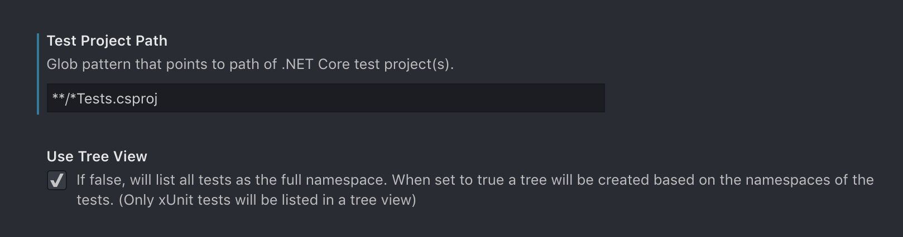
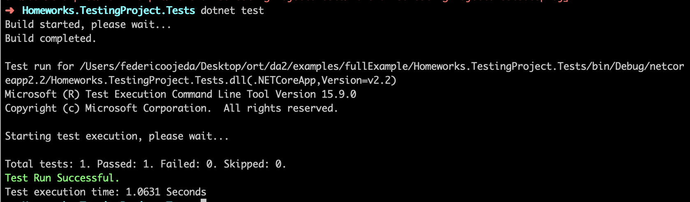
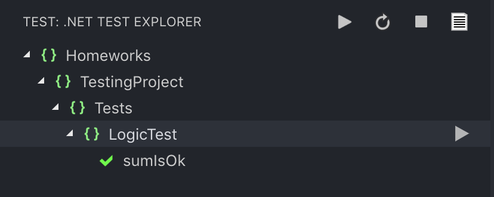
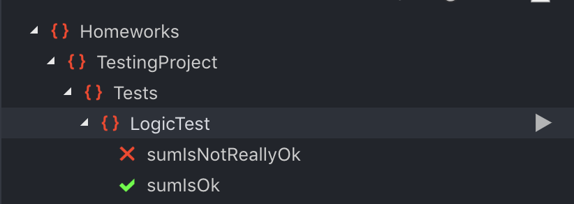
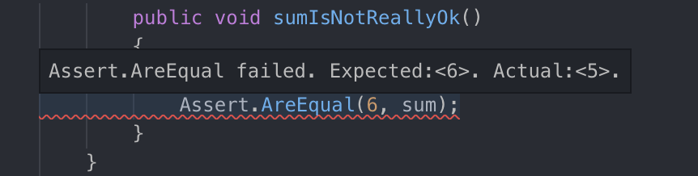
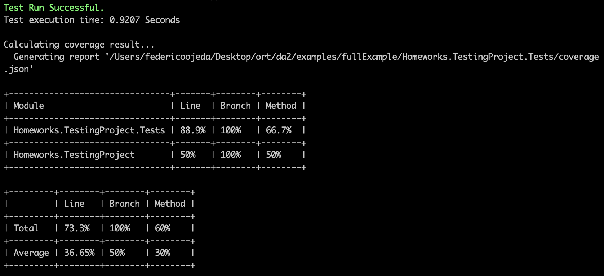
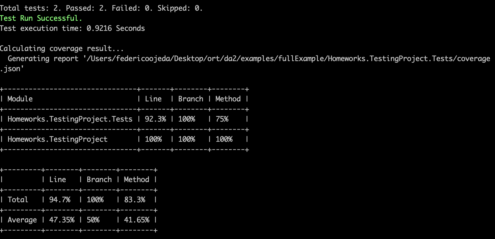

# Clase 5 - Testing

Como toda plataforma, el testing es una parte esencial del desarrollo del software. En particular en este caso, hablaremos sobre el unit testing en .NET Core. 

## Testing en .NET Core

Existen varias opciones para crear tests en .NET Core. La primera es elegir con que framework hacerlos:

* **xUnit:** El ya visto en materias anteriores
* **NUnit:** Otro framework muy conocido utilizado para hacer pruebas unitarias
* **MSTest:** MSTest es un framework de microsoft muy facil de utilizar. Este sera el seleccionado para el curso

Cabe aclarar que la creacion de los proyectos de tests y la ejecución de los mismos (no importa el framework seleccionado) son realizados facilmente desde la consola y/o desde alguna extension del Visual Studio Code.

## Setup

Primero agregaremos algunas extensions a VSCode que nos seran de suma utilidad.

Instalaremos **.NET Core Test Explorer**, esta nos permitirá explorar las pruebas creadas con mayor facilidad. Podemos buscarla desde el buscador de extensiones o en este [link](https://marketplace.visualstudio.com/items?itemName=formulahendry.dotnet-test-explorer)


Luego lo configuraremos para que detecte nuestros proyectos de prueba. Para esto agregaremos la siguiente configuración a nuestro espacio de trabajo. Debemos ir a la configuracion de VSCode e ingresar lo siguiente:

_Vieja version de VSCode:_


_Nueva version de VSCode:_



Aqui introdujimos una pequeña expresion regular. Los projectos que cumplan con ella sera los que la extension utilizará para correr tests.

## Creación de proyecto

Para crear un proyecto de tests, utilizaremos el comando `dotnet new mstest`.

```
dotnet new mstest -n Homeworks.TestingProject.Tests
```

Dentro de este proyecto, vamos a agregar un archivo de testing que se llame `LogicTest.cs` muy simple. Lo primero que haremos sera agregar la declaracion using `using Microsoft.VisualStudio.TestTools.UnitTesting;`, para indicar que estamos utilizando el framework de UnitTesting


Muy similarmente a xUnit, el framework utiliza **tags** (como `[TestClass]` o `[TestMethod]`) para indicar que una clase contiene tests o que un metodo es de tests. Tambien se utilizan tags para otras funcionalidades, como pasar parametros a los tests, etc. Crearemos dentro del archivo la clase `LogicTest` con el metodo `sumIsOk`.

```c#
using Microsoft.VisualStudio.TestTools.UnitTesting;

namespace Homeworks.TestingProject.Tests
{
    [TestClass]
    public class LogicTest
    {
        [TestMethod]
        public void SumIsOk()
        {
        }
    }
}
```

### Test exitoso

Es hora de crear el test. Para esto, haremos una simple suma y verificaremos que su resultado sea correcto. Lo haremos usando el metodo de Assert, `Assert.IsEqual(valor1, valor2)`, que verifica que dos valores sean iguales

```c#
using Microsoft.VisualStudio.TestTools.UnitTesting;

namespace Homeworks.TestingProject.Tests
{
    [TestClass]
    public class LogicTest
    {
        [TestMethod]
        public void SumIsOk()
        {
            int sum = 2 + 2;
            Assert.AreEqual(4, sum);
        }
    }
}
```

Una vez creado el test, debemos correrlo. Para esto, tenemos dos opciones. Podemos correrlo desde la consola, donde se nos mostrara el output ahi mismo:

```
dotnet tests
```

**Output:**



O podemos correrlo utilizando la extension que instalamos previamente. Para eso la seleccionamos (La proveta que se encuentra en la barra de la izquierda del VSCode) y seleccionamos el boton de play.

**Output:**




### Test que falla

Igualmente que como creamos el anterior test, crearemos uno que falle para ver el resultado. Agregamos el siguiente test.

```c#
using Microsoft.VisualStudio.TestTools.UnitTesting;

namespace Homeworks.TestingProject.Tests
{
    [TestClass]
    public class LogicTest
    {
        [TestMethod]
        public void SumIsOk()
        {
            int sum = 2 + 2;
            Assert.AreEqual(4, sum);
        }

        [TestMethod]
        public void SumIsNotReallyOk()
        {
            int sum = 2 + 3;
            Assert.AreEqual(6, sum);
        }
    }
}
```

Luego de correrlos nuevamente, podemos ver como el test falla:



Y hasta se muestra la razon de porque fallo inline:



## Test coverage

A pesar de no existir herramientas integradas a un IDE, como si nos pasaba con visual studio, eso no significa que sea dificil obtener el test coverage de nuestros tests. Para ellos existen excelentes herramientas que nos permitiran obtener el test coverage de manera simple. La que usaremos se llama [Coverlet](https://github.com/tonerdo/coverlet), y es tan facil como agregar un paquete a la libreria. 

Haremos un pequeño ejemplo para mostrar como funciona esta herramienta.

Primero, volveremos a la carpeta principal, y crearemos un nuevo proyecto llamado `Homeworks.TestingProject`

```
dotnet new classlib -n Homeworks.TestingProject
```

Luego, nos moveremos nuevamente al proyecto de tests (`cd Homeworks.TestingProject.Tests`) y agregaremos una referencia al nuevo proyecto que agregamos.

```
dotnet add reference ../Homeworks.TestingProject
```

Por ultimo, dentro del proyecto de tests agregaremos como dependencia Coverlet

```
dotnet add package coverlet.msbuild  
```

Dentro de `Homeworks.TestingProject`, crearemos la clase `ModuleToTest` y agregaremos un par de metodos.

```c#
using System;

namespace Homeworks.TestingProject
{
    public class ToTest
    {
        public int FirstMethod() {
            return 5;
        }

        public int SecondMethod() {
            return 6;
        }
    }
}
```

Volviendo a la clase de test que tenemos en `Homeworks.TestingProject.Tests`, importaremos esta clase usando la directiva `using`, y dejaremos un solo metodo de tests que llame a `FirstMethod` y verifique su resultado.

```c#
using Microsoft.VisualStudio.TestTools.UnitTesting;
using Homeworks.TestingProject;

namespace Homeworks.TestingProject.Tests
{
    [TestClass]
    public class LogicTest
    {
        private readonly ToTest toTest;

        public LogicTest()
        {
            toTest = new ToTest();
        }

        [TestMethod]
        public void FirstMethodIsOk()
        {
            int result = toTest.FirstMethod();
            Assert.AreEqual(5, result);
        }
    }
}
```

Si corremos los tests desde la extension de VS Code, podemos ver que el test pasa correctamente.

Sin embargo, para poder ver el output del test coverage, debemos correrlo desde la consola. Dentro del proyecto, corremos el siguiente comando

```
dotnet test /p:CollectCoverage=true
```

Este comando corre los tests, y con la flat `CollectCoverage=true` le indicamos que efectivamente busque el code coverage. Luego de ejecutarlo, vemos el siguiente resultado:



Si nos fijamos, en `Homeworks.TestingProject` tenemos un 50% de los `methods` cubiertos. Agregaremos otro test para solucionar esto. Vamos a la clase de tests y agregamos uno que llame a `SecondMethod`.

```c#
using Microsoft.VisualStudio.TestTools.UnitTesting;
using Homeworks.TestingProject;

namespace Homeworks.TestingProject.Tests
{
    [TestClass]
    public class LogicTest
    {
        private readonly ToTest toTest;

        public LogicTest()
        {
            toTest = new ToTest();
        }

        [TestMethod]
        public void FirstMethodIsOk()
        {
            int result = toTest.FirstMethod();
            Assert.AreEqual(5, result);
        }

        [TestMethod]
        public void SecondMethodIsOk()
        {
            int result = toTest.SecondMethod();
            Assert.AreEqual(6, result);
        }
    }
}
```

Si corremos los tests nuevamente desde la consola, obteniendo el coverage, vemos otro resultado



Podemos ver que `Homeworks.TestingProject` tiene un 100% de test coverage. 

Coverlet tiene muchas mas funcionalidades que pueden investigar en su documentación. Por ultimo, pueden revisar el archivo `.json` que es creado (su ubicación se muestra en el output de consola).